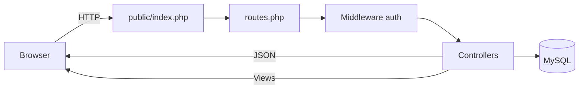

# AtendeLab

Sistema web para **controle de atendimentos acadêmicos** — cadastro de pessoas atendidas, tipos de atendimento, registro de solicitações e acompanhamento de status. Desenvolvido no contexto da disciplina de **Fábrica de Software**.

O projeto combina uma interface em PHP + Bootstrap com uma API JSON interna consumida via JavaScript, permitindo CRUD completo sem recarregar a página.

---

## Funcionalidades

| Módulo | O que faz |
|--------|-----------|
| **Autenticação** | Login com sessão PHP, proteção de rotas e logout seguro |
| **Dashboard** | Indicadores (pessoas, tipos, atendimentos) e atalhos para os módulos |
| **Pessoas** | Cadastro de alunos/atendidos com curso, período e inativação lógica |
| **Tipos** | Categorias de atendimento (ex.: declaração, matrícula) |
| **Atendimentos** | Registro com data/hora, responsável logado e fluxo de status |
| **Usuários** | API REST para gestão de contas (perfis: admin, atendente, aluno) |

**Fluxo de status dos atendimentos:** `aberto` → `em_andamento` → `concluido` (observação obrigatória ao concluir).

---

## Stack

- **Backend:** PHP 8+ (PDO, controllers, middleware de sessão)
- **Banco:** MySQL / MariaDB
- **Frontend:** HTML, CSS, Bootstrap 5.3, JavaScript (Fetch API)
- **Servidor local:** Apache (XAMPP)

---

## Arquitetura



Todas as requisições passam por `public/index.php`, que carrega o roteador em `routes.php`. Os parâmetros `controller` e `action` definem qual recurso será executado.

**Estrutura de pastas:**

```
atendelab/
├── app/
│   ├── Controllers/     # Lógica e endpoints JSON
│   ├── Middleware/      # Autenticação por sessão
│   └── Views/           # Telas PHP + layouts
├── config/
│   └── database.php     # Conexão PDO
├── database/
│   └── atendelab.sql    # Schema e dados iniciais
├── public/              # Document root (Apache)
│   ├── index.php
│   └── assets/          # CSS, JS e imagens
└── routes.php           # Roteamento central
```

---

## Pré-requisitos

- [XAMPP](https://www.apachefriends.org/) (ou Apache + PHP 8+ + MySQL)
- PHP com extensões `pdo` e `pdo_mysql`
- Git

---

## Instalação

### 1. Clonar o repositório

```bash
git clone https://github.com/fagsgabriel/atendelab_fabrica_de_software__Univille__.git
```

Coloque a pasta em `C:\xampp\htdocs\atendelab` (ou equivalente no seu SO).

### 2. Subir os serviços

Inicie **Apache** e **MySQL** no painel do XAMPP.

### 3. Criar o banco de dados

Abra o phpMyAdmin (`http://localhost/phpmyadmin`) e importe o arquivo:

```
database/atendelab.sql
```

Ou via terminal:

```bash
C:\xampp\mysql\bin\mysql.exe -u root < database/atendelab.sql
```

### 4. Configurar a conexão

Edite `config/database.php` se necessário (padrão XAMPP):

| Variável   | Padrão      |
|------------|-------------|
| `$host`    | `localhost` |
| `$dbname`  | `atendelab` |
| `$user`    | `root`      |
| `$password`| *(vazio)*   |

### 5. Ajustar a URL base (se o caminho for diferente)

Se o projeto não estiver em `/atendelab/public/`, atualize:

- `app/Views/layouts/config-view.php` → `$baseUrl`
- `public/assets/js/api.js` → `baseUrl`

### 6. Acessar o sistema

| URL | Descrição |
|-----|-----------|
| http://localhost/atendelab/public/ | Tela de login |
| http://localhost/atendelab/public/teste-conexao.php | Teste rápido do PDO |

**Credenciais padrão:**

| E-mail | Senha |
|--------|-------|
| `admin@atendelab.com` | `admin123` |

> Altere a senha do administrador após o primeiro acesso em ambiente real.

---

## API interna

Endpoints protegidos exigem sessão ativa (login prévio). Respostas em JSON (`Content-Type: application/json`).

| Controller | Actions |
|------------|---------|
| `auth` | `login`, `entrar`, `dashboard`, `logout` |
| `pessoas` | `listar`, `buscarPorId`, `criar`, `atualizar`, `inativar` |
| `tipos` | `listar`, `buscarPorId`, `criar`, `atualizar`, `inativar` |
| `atendimentos` | `listar`, `buscarPorId`, `criar`, `alterarStatus` |
| `usuarios` | `listar`, `buscarPorId`, `criar`, `atualizar`, `excluir` |
| `dashboard` | `resumo` |
| `frontend` | `pessoas`, `tipos`, `atendimentos` *(telas)* |

**Exemplo:**

```
GET /atendelab/public/?controller=pessoas&action=listar
POST /atendelab/public/?controller=atendimentos&action=criar
```

O helper `AtendeLabApi` em `public/assets/js/api.js` encapsula essas chamadas no frontend.

---

## Desenvolvimento

- **Roteamento:** adicione novos `case` em `routes.php` e crie o controller correspondente em `app/Controllers/`.
- **Views:** telas autenticadas usam `header.php` / `footer.php`; dados dinâmicos vêm da API via JavaScript.
- **Models:** a pasta `app/Models/` está reservada para evolução futura — hoje a lógica de acesso ao banco fica nos controllers.

---

## Licença

Projeto acadêmico — uso livre para fins educacionais.
